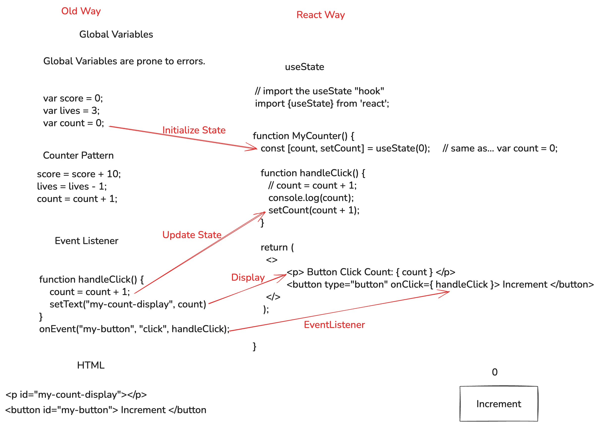

# Week 3

## Day 1

* `onClick` callbacks for click
* `const [count, setCount] = useState(0)` setting "global variables"

### Day 1 TODO

1. Create a new project with `npm create vite@latest` called "state-practice"
   * `npm create vite@latest`
   * Project Name: "state-practice"
   * Framework: "React"
   * "JavaScript"
   * Use rolldown-vite: no
   * Install with npm and start now: no
   * `cd state-practice`
   * `npm install`
   * `code .`
   * `git init`
   * `git add .`
   * `git commit -m "initialize project"`
   * `npm run dev`
2. Examine the starter code.
3. Change the counter to use a named function called `handleClick` like we see in the diagram above.

  
Show Me:

  

4. Change the starter code to count by 2's instead of 1's
5. Create a new button and a new callback function, to increment the count by 3's
6. Try to make one to count by other amounts.
7. Make callbacks that decrement and attach them to buttons.
8. Make a callback that resets the count to 0 and a button called "Reset".

Challenge: Use [conditional rendering](https://react.dev/learn#conditional-rendering) to make something change when the count is greater than 100.

* Example demo code is [here](https://github.com/rmccrear/state-practice-demo-2025)

## Day 2

* style in React
* conditional rendering
* multiple state variables
* [Demo code--basketball score keeper](https://github.com/rmccrear/basketball-score)

### Day 2 TODO

1. Make a new project called "game-scores"
2. Remove all the CSS and unnecessary JSX
3. Add Bootstrap
4. Add scores for one team. (If basketball, have 1 point for free throw, 3 for three pointer, etc)
5. Add some style with regular css.
6. Add some style with JSX
7. After X points, use conditional formatting to change something on the screen

**Bonus...**

8. Add timeouts, fouls or other stats to keep track of.
9. Add scores for the other team.
10. Add more conditional formatting. (Show who is winning, who is in foul trouble, etc...)

## Day 3

### Code.org List Traversals.

#### Overview

* List traversals: touch every item on a list.
    * Example: A list of times for a mile run.
    * Print each time out.
    * Add all the times up.
    * Average the times.
    * Find the fastest time.
    * Find the slowest time.

#### Lessons

* Lesson 9: https://studio.code.org/courses/csp-2025/units/6/lessons/9/levels/1?login_required=true
* Lesson 10: https://studio.code.org/courses/csp-2025/units/6/lessons/10/levels/1?login_required=true
* Lesson 11: https://studio.code.org/courses/csp-2025/units/6/lessons/11/levels/1?login_required=true
* Lesson 11: https://studio.code.org/courses/csp-2025/units/6/lessons/11/levels/1?login_required=true
* Lesson 12: https://studio.code.org/courses/csp-2025/units/6/lessons/12/levels/1?login_required=true (Activity Guide: doc)

#### List Traversal Resources

* [Video: Processing Lists](https://youtu.be/RQ6GJt9f2vg)
* [Video: Code.org Walkthrough](https://www.youtube.com/watch?v=5TP97iZwksc&list=PLbsvRhEyGkKdgJMsglJeEYIynDpthpOZB&index=19)
* [List Filter Pattern](https://studio.code.org/docs/concepts/patterns/list-filter-pattern/)
* [List Reduce Pattern](https://studio.code.org/docs/concepts/patterns/list-reduce-pattern/)
* [code.org slides](https://docs.google.com/presentation/d/1l_mpNKjAK73OlGNpll-0fWEPnsHaP3YeLffqHKN9oPE/edit?slide=id.g62fa39d25b_0_413#slide=id.g62fa39d25b_0_413)

## Day 4

[Mini-Project](./week3/react-clicker-game-mini-project/react-clicker-game-lv-1.md)