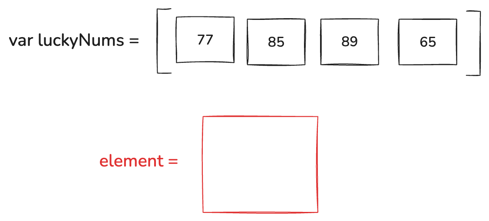
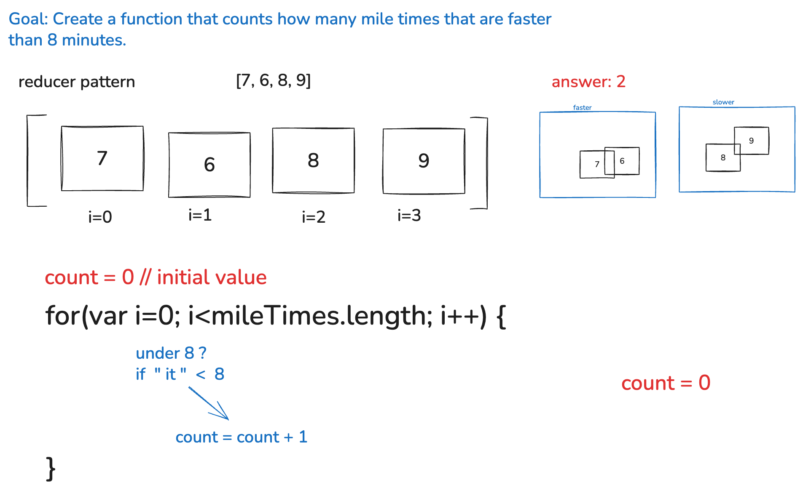
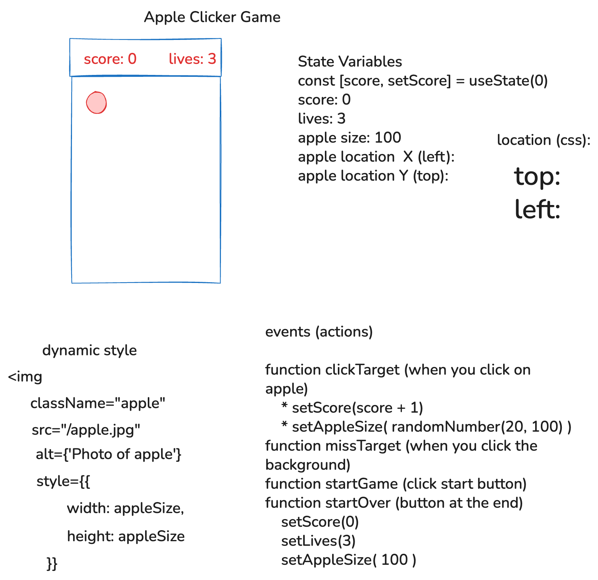
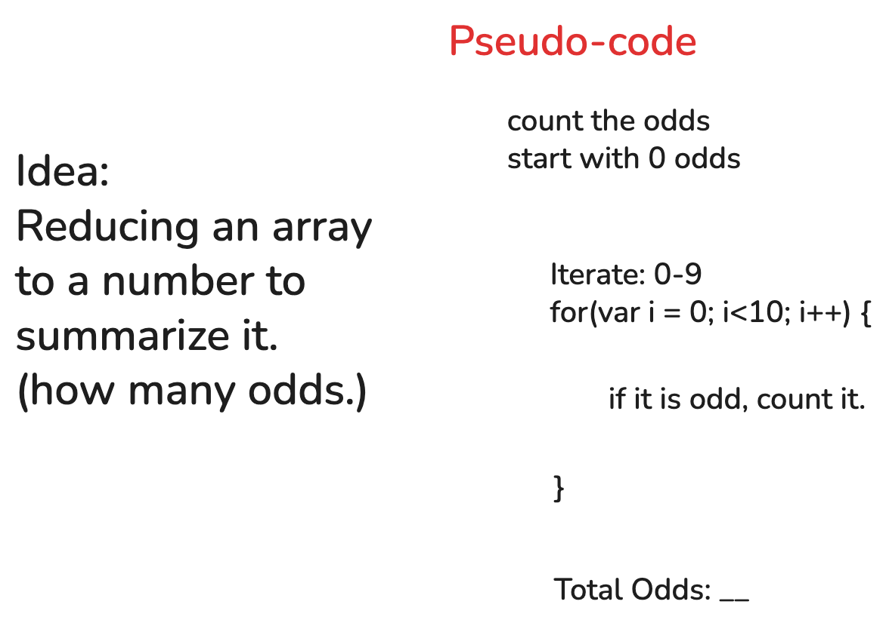
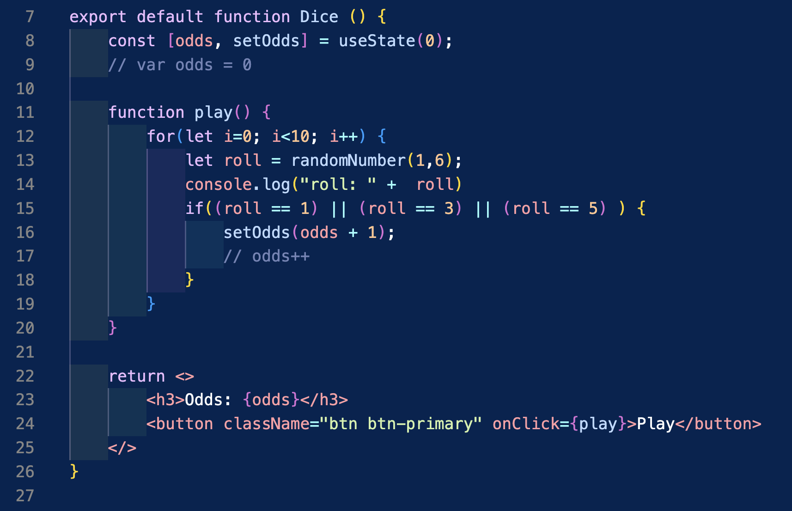

# Week 3

### Video Tutorials

* [Video tutorial of React from Web Dev Simplified](https://www.youtube.com/watch?v=Rh3tobg7hEo&t=70s)
* Mosh's React Tutorial (With timestamps)
  * [Installing Bootstrap in React](https://youtu.be/SqcY0GlETPk?si=S2fpApHG6j1OOBpD&t=1330)
  * [Conditional Rendering](https://www.youtube.com/watch?v=SqcY0GlETPk&t=1991s)
  * [Props in React](https://www.youtube.com/watch?v=SqcY0GlETPk&t=3044s) (Note: we aren't using Typescript, so you won't need the `:Props` syntax or the `interface Props` statement.)
  * Bro Code React Tutorial (With timestamps)
    * [Starting a new project with Vite by Bro Code](https://youtu.be/hn80mWvP-9g?si=id3HzZrL9CNiXRP3&t=493) (This video includes what you can delete from the starter code when you create a new vite app.)
    * [Creating a new component in its own file.](https://youtu.be/hn80mWvP-9g?si=Rm0ySZSPLJyTUoYx&t=547)
    * [How to use `onClick` in React](https://youtu.be/KpiiKuqNlYw?si=nDHeWyKHJqCBBMBU&t=75)

## Day 1

* `onClick` callbacks for click
* `const [count, setCount] = useState(0)` setting "global variables"

*Comparison showing traditional DOM manipulation versus React's state-based approach for updating counters*

### Day 1 TODO

1. Create a new project with `npm create vite@latest` called "state-practice"
   * `npm create vite@latest`
   * Project Name: "state-practice"
   * Framework: "React"
   * "JavaScript"
   * Use rolldown-vite: no
   * Install with npm and start now: no
   * `cd state-practice`
   * `npm install`
   * `code .`
   * `git init`
   * `git add .`
   * `git commit -m "initialize project"`
   * `npm run dev`
2. Examine the starter code.
3. Change the counter to use a named function called `handleClick` like we see in the diagram above.

  
Show Me:

  
  
  *Example code modifications for the Vite starter project, showing how to implement the handleClick function*

4. Change the starter code to count by 2's instead of 1's
5. Create a new button and a new callback function, to increment the count by 3's
6. Try to make one to count by other amounts.
7. Make callbacks that decrement and attach them to buttons.
8. Make a callback that resets the count to 0 and a button called "Reset".

Challenge: Use [conditional rendering](https://react.dev/learn#conditional-rendering) to make something change when the count is greater than 100.

* Example demo code is [here](https://github.com/rmccrear/state-practice-demo-2025)

## Day 2

* style in React
* conditional rendering
* multiple state variables
* [Demo code--basketball score keeper](https://github.com/rmccrear/basketball-score)

### Day 2 TODO

1. Make a new project called "game-scores"
2. Remove all the CSS and unnecessary JSX
3. Add Bootstrap
4. Add scores for one team. (If basketball, have 1 point for free throw, 3 for three pointer, etc)
5. Add some style with regular css.
6. Add some style with JSX
7. After X points, use conditional formatting to change something on the screen

**Bonus...**

8. Add timeouts, fouls or other stats to keep track of.
9. Add scores for the other team.
10. Add more conditional formatting. (Show who is winning, who is in foul trouble, etc...)

## Day 3

### Code.org List Traversals.

#### Warmup

* [Array review--Representing Image Data as a List](https://studio.code.org/courses/csd-2025/units/6/lessons/4/levels/3)
* [Video on List Traversals](https://youtu.be/RQ6GJt9f2vg?si=CM08_CE12FbVULgp)
* [Demo code for Representing Image Data as a List](./week3/arrays-and-loops/invert-images.js)

#### Overview

* [For Loop Slides]([code.org slides](https://docs.google.com/presentation/d/1l_mpNKjAK73OlGNpll-0fWEPnsHaP3YeLffqHKN9oPE/edit?slide=id.g62fa39d25b_0_413#slide=id.g62fa39d25b_0_413))
* [Mile Tracker Slides](https://docs.google.com/presentation/d/1zS7j6oCW0rzownz-Fg12M-UheRiRs7W8ENm1cZJv4VQ/template/preview)

*Whiteboard diagram demonstrating array concepts and list traversal patterns*

* List traversals: touch every item on a list.
    * Example: A list of times for a mile run.
    * Print each time out.
    * Add all the times up.
    * Average the times.
    * Find the fastest time.
    * Find the slowest time.

#### Total Miles added up [Lesson 10 Level 2](https://studio.code.org/courses/csp-2025/units/6/lessons/10/levels/2)

*Code.org screenshot showing how to sum all values in a miles array*

#### Count all miles under 8 minutes [also Lesson 10 Level 2](https://studio.code.org/courses/csp-2025/units/6/lessons/10/levels/2)

*Code.org screenshot demonstrating how to count/filter values under a specific threshold (8 minutes)*

#### Lessons

* Lesson 9: https://studio.code.org/courses/csp-2025/units/6/lessons/9/levels/1?login_required=true
* Lesson 10: https://studio.code.org/courses/csp-2025/units/6/lessons/10/levels/1?login_required=true
* ~~Lesson 11: https://studio.code.org/courses/csp-2025/units/6/lessons/11/levels/1?login_required=true~~
* ~~Lesson 12: https://studio.code.org/courses/csp-2025/units/6/lessons/12/levels/1?login_required=true (Activity Guide: doc)~~

#### List Traversal Resources

* [Video: Processing Lists](https://youtu.be/RQ6GJt9f2vg)
* [Video: Code.org Walkthrough](https://www.youtube.com/watch?v=5TP97iZwksc&list=PLbsvRhEyGkKdgJMsglJeEYIynDpthpOZB&index=19)
* [List Filter Pattern](https://studio.code.org/docs/concepts/patterns/list-filter-pattern/)
* [List Reduce Pattern](https://studio.code.org/docs/concepts/patterns/list-reduce-pattern/)
* [code.org slides](https://docs.google.com/presentation/d/1l_mpNKjAK73OlGNpll-0fWEPnsHaP3YeLffqHKN9oPE/edit?slide=id.g62fa39d25b_0_413#slide=id.g62fa39d25b_0_413)

## Day 4

Today you'll work on the **Apple Clicker Mini-Project** - a React game where you'll practice state management, event handling, and dynamic styling by building an interactive clicking game.

[Mini-Project](./week3/react-clicker-game-mini-project/react-clicker-game-lv-1.md)

*Planning diagram showing the Apple Clicker game UI, state variables, dynamic styling, and event handlers*

### Review

#### [Lesson 7 Level 9 Dice Roll](https://studio.code.org/courses/csp-2025/units/6/lessons/7/levels/9)

*Whiteboard showing dice roll simulation and counting odd numbers - a conditional logic example*

*React component code showing dice roll simulation with useState hook and conditional logic for counting odd numbers*

**Note:** Best practice when updating state in loops is to use `setOdds(prev => prev + 1)` or accumulate in a temporary variable and call `setOdds` only once after the loop completes. Avoid calling `setOdds` directly in loops as it can lead to stale state issues.

## Day 5

Today you'll continue working on the **Apple Clicker Mini-Project** and complete the **Code.org lessons** on conditionals and list traversals. You'll finish building your React games while reinforcing concepts from the Code.org curriculum.

* Demo code for the Dice practice [Lesson 7 Level 9](https://studio.code.org/courses/csp-2025/units/6/lessons/7/levels/9)
https://github.com/rmccrear/basketball-score/blob/dice/src/components/Dice.jsx