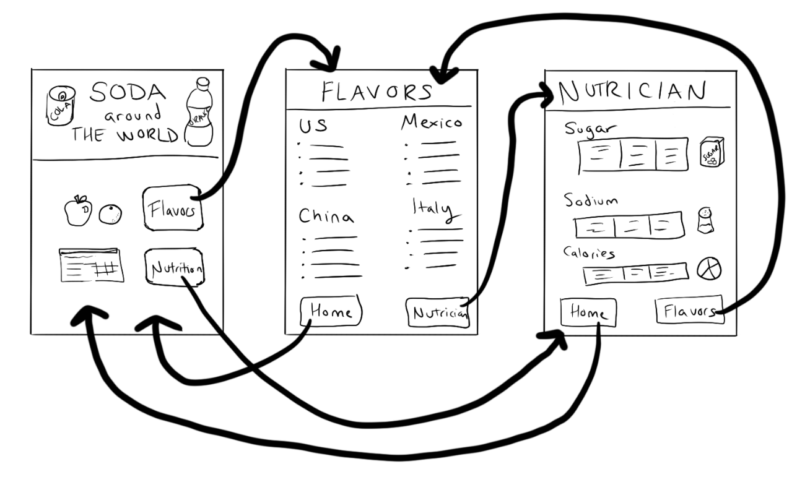

# Week 4

## Day 1

* [Hackathon Planning Sheet](https://docs.google.com/document/d/12QYQpFen_lD5iYS1hy4Wmtc0_QUq0cHjWwoyR-LEViw/edit?usp=sharing)
* [Hackathon on Code.org for data access](https://studio.code.org/courses/csp-2025/units/6/lessons/13/levels/1)
* [How to import data--Spreadsheets to JSON](./HOWTO_CODE_ORG_DATA_IMPORT.md)

### Hackathon Overview

#### You will submit
* Your final app
* This completed project-planning guide
* A written response

#### App Requirements
* At least three screens
* All screens can be easily navigated to through the user interface
* A dataset used in a meaningful way towards the programs purpose
* At least one list is traversed using: map, reduce, or filter (indicate which in a comment) in a meaningful way towards the program's purpose
* Programming constructs: variable(s), function(s), conditional(s), list(s), loop(s)
* All functions include comments that explain their purpose and how they work
* No errors in the code

#### Steps
1. Collaborate with your partner to pick a dataset
2. Decide on an app to build which traverses a list from the dataset
3. Create a paper prototype
4. Designer:
    * Create the screens
* Support the programmer with pair programming as needed
5. Programmer: 
    * Program the app
    * Support the designer as needed. 

#### List brainstorm

Choose **at least** one traversal method to use in your app

* MAP (do one thing to every item in the list)
* REDUCE (summarize something about this list into a single number or string)
* FILTER (select only a few elements out of a list)

#### Design Phase

With a Partner, Create a Paper Prototype: You should draw a prototype that shows how your app will actually run. This means you should include all the buttons, text, and images that the user will be able to use and see. Write notes or draw arrows showing how different user interface elements should work. For example, if clicking a button takes me to another screen, I should draw an arrow from that button to the drawing of the screen. 

